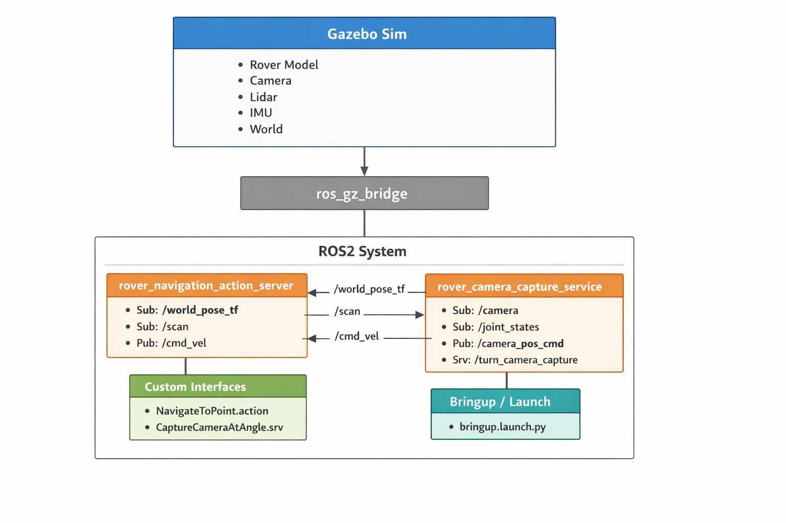
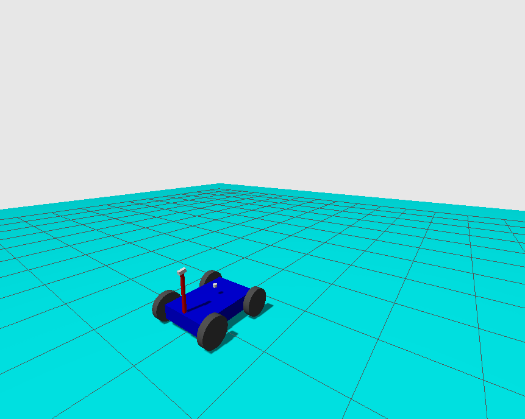
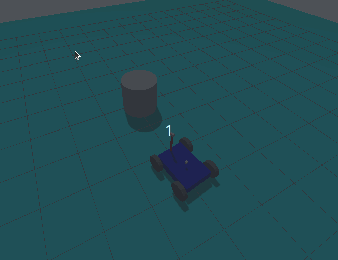
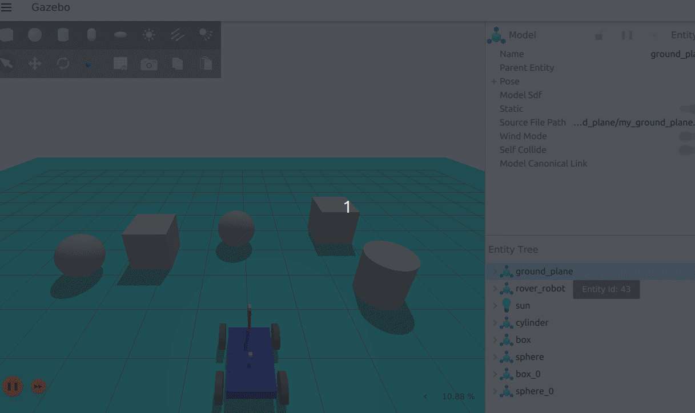
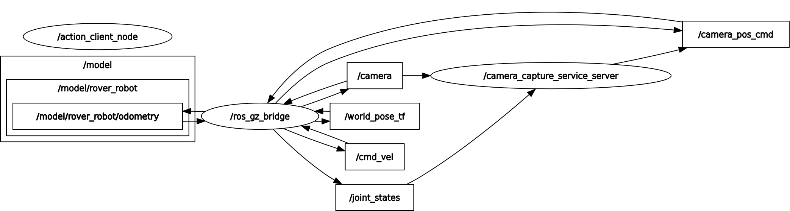

# ROS2 Rover Inspection Robot

This project implements a simulated inspection rover using ROS2 Humble, Python, and Gazebo Sim.

The rover demonstrates core robotics capabilities including:

- ROS2 Nodes
- ROS2 Actions
- ROS2 Services
- Gazebo robot simulation
- Sensor integration (camera, lidar, IMU)
- ROS ↔ Gazebo topic bridging
- Autonomous navigation with obstacle avoidance

## System Architecture

The following diagram illustrates the architecture of the rover inspection robot system and the interaction between Gazebo simulation and ROS2 nodes.

## Simulation

The rover inspection robot running inside Gazebo Sim.

## Demo

The rover inspection robot can autonomously navigate to a goal while avoiding obstacles and capture images using a controllable camera.

### Send a navigation goal

`ros2 run rover_control rover_navigation_action_client`

Then user is prompted to insert x, y, z of the target point or, another option, user can send the target point as an action directly:

`ros2 action send_goal /navigate rover_interfaces/action/NavigateToPoint "{goal_point: {x: 4.0, y: 2.0, z: 0.0}}"`

The rover will drive toward the target point while using lidar data to avoid obstacles.

### Capture an image at a camera angle

`ros2 run rover_control rover_camera_capture_service_client 1.57`

Or, 

`ros2 service call /turn_camera_capture rover_interfaces/srv/CaptureCameraAtAngle "{angle: 1.57}"`

The camera rotates to the requested angle and returns the captured image.

## Workspace Structure

rover_ws/
 └── src/
     ├── rover_description
     ├── rover_simulation
     ├── rover_interfaces
     ├── rover_control
     └── rover_bringup

## Running the Simulation

Build the workspace:

`colcon build`
`source install/setup.bash`

Launch the rover simulation:

`ros2 launch rover_bringup bringup.launch.py`

## Technologies Used

- ROS2 Humble
- Gazebo Sim (Ignition)
- Python
- ros_gz_bridge

## ROS graph

---

This project was developed as a ROS2 robotics portfolio project.
